# YZM304 Derin Öğrenme — Proje 2: CNN ile Özellik Çıkarma ve Sınıflandırma

**Ankara Üniversitesi · Yapay Zeka ve Veri Mühendisliği Bölümü · 2025–2026 Bahar**

---

## Özet

Bu çalışmada evrişimli sinir ağları (CNN) görüntü sınıflandırma problemi için iki veri seti (MNIST ve CIFAR-10) üzerinde beş farklı değerlendirme kurgusu karşılaştırılmıştır. Model 1 (klasik LeNet-5) ve Model 2 (BatchNorm + Dropout eklenmiş LeNet-5) MNIST üzerinde, Model 3 (CIFAR-10 için uyarlanmış ResNet-18) uçtan uca eğitilmiş; Model 4'te Model 3'ün son tam-bağlı katmanı öncesinde elde edilen 512 boyutlu temsiller üzerine SVM ve Random Forest sınıflandırıcıları takılmış; Model 5 ise PDF'deki izin maddesine dayanarak yeni bir eğitim koşusu yerine Model 3 ağırlıklarının aynı test hattında yeniden değerlendirilmiş hâlidir. MNIST'te Model 2, Model 1'e göre %98.80 → **%99.15** test doğruluğuna çıkmıştır. CIFAR-10'da uçtan uca ResNet-18 **%94.08** test doğruluğu sağlarken, aynı temsil üzerine kurulan SVM **%94.01**, Random Forest **%93.96** elde etmiştir. Böylece hibrit yaklaşımın, öğrenilmiş CNN temsilleri üzerinde uçtan uca sınıflandırıcıya çok yakın sonuç verdiği görülmüştür.

## Teslim Notu

- Bu depo ödev PDF'indeki gereksinimleri karşılayacak şekilde düzenlenmiştir: açık yazılmış iki CNN sınıfı, literatürden bir hazır CNN mimarisi, hibrit özellik çıkarma + klasik makine öğrenmesi akışı ve IMRAD formatında rapor.
- Model 5 için ayrı bir sıfırdan eğitim yapılmamıştır. PDF'deki *"ilk 3 modelden biri seçilecekse aynı veri setleri kullanılacak olup 5. model kullanımına gerek yoktur"* maddesine dayanarak, Model 3'ün en iyi ağırlıkları aynı test pipeline'ında yeniden değerlendirilmiş ve Model 4 ile karşılaştırılmıştır.
- Model 4a SVM, hesaplama maliyeti nedeniyle her sınıftan 1000 örnek seçilen dengeli 10 000 örneklik alt kümede eğitilmiştir. Random Forest modeli ise 50 000 örneklik tam eğitim seti ile eğitilmiştir. Bu asimetri raporda açıkça belirtilmiştir.
- Notebook dosyaları yardımcı materyaldir; çekirdek teslim içeriği `models/`, `scripts/`, `results/` ve bu README dosyasıdır.
- Büyük ikili dosyalar (`.pth`, `.npy`) GitHub deposuna eklenmemiş olabilir. Bunun nedeni hem GitHub boyut sınırları hem de bu dosyaların ilgili scriptler çalıştırılarak yeniden üretilebilir olmasıdır. Değerlendirme için esas alınması gereken içerik kod, rapor ve `results/metrics` ile `results/figures` altındaki çıktı dosyalarıdır.

---

## 1. Giriş

Görüntü sınıflandırma, bilgisayarla görmenin çekirdek problemidir. Klasik makine öğrenmesi yaklaşımları elle tasarlanmış özellik çıkarıcılarına (HOG, SIFT, LBP vb.) ve ardından gelen bir sınıflandırıcıya (SVM, Random Forest) dayanır. Evrişimli sinir ağları (CNN) ise öznitelik çıkarımını ve sınıflandırmayı tek bir uçtan uca optimize edilen mimari içinde birleştirir. Yerel alıcı alanlar, ağırlık paylaşımı ve hiyerarşik özellik haritaları sayesinde CNN'ler piksellerden soyut kavramlara (kenar → doku → parça → nesne) doğru uzanan otomatik bir temsil hiyerarşisi öğrenir.

**LeNet-5** (LeCun vd., 1998), 32×32 el yazısı rakam tanıma için önerilen ve modern CNN'lerin şablonunu belirleyen mimaridir: art arda iki konvolüsyon + alt-örnekleme bloğu, ardından tam-bağlı sınıflandırıcı. O tarihten bu yana üç önemli mühendislik bileşeni eklenmiştir:

- **Batch Normalization (Ioffe & Szegedy, 2015):** Her mini-batch'in aktivasyonlarını normalize ederek "internal covariate shift"i azaltır, gradyan akışını stabilize eder, daha yüksek öğrenme oranlarına ve daha hızlı yakınsamaya izin verir.
- **Dropout (Srivastava vd., 2014):** Eğitim sırasında rastgele nöronları devre dışı bırakarak ağı ensemble benzeri bir davranışa zorlar, aşırı uyumu (overfitting) bastırır.
- **Residual bağlantılar (He vd., 2016):** Çok derin ağlarda gradyan kaybolması problemini çözer. `y = F(x) + x` biçimindeki skip connection, ağın "kimlik eşlemesini" kolayca öğrenmesine olanak verir ve 100+ katmanlı modellerin pratikte eğitilmesini mümkün kılar. ResNet-18 bu ailenin en kompakt temsilcisidir.

**Hibrit yaklaşım**, CNN'i öznitelik çıkarıcı olarak kullanıp son sınıflandırmayı klasik bir makine öğrenmesi modeliyle yapar. Motivasyonu iki yönlüdür: (i) CNN'in ortak öznitelikleri farklı sınıflandırıcılara taşınabilir; (ii) temsilin kalitesi klasik bir modelle ölçülebildiğinde, ağın "ne öğrendiği" hakkında bilgi verir.

Bu çalışmanın amacı, beş modelin (i) aynı veri setinde karşılaştırmalı test performansını, (ii) mimari değişikliklerin etkisini, (iii) CNN öznitelikleri üzerine kurulan klasik sınıflandırıcıların uçtan uca eğitilmiş modele yaklaşıp yaklaşamadığını tekrarlanabilir biçimde raporlamaktır.

---

## 2. Method

### 2.1 Veri Setleri

- **MNIST** (LeCun vd., 1998): 28×28 gri tonlamalı el yazısı rakam görüntüleri, 60 000 eğitim + 10 000 test, 10 sınıf. LeNet-5 32×32 girişle tasarlandığı için `transforms.Pad(2)` ile sıfır dolgulu genişletme yapılmış, ardından `Normalize((0.5,), (0.5,))` uygulanmıştır. Aşırı örnekleme / artırma kullanılmamıştır; MNIST doyuma yakın bir problemdir.
- **CIFAR-10** (Krizhevsky, 2009): 32×32 RGB doğa/nesne görüntüleri, 50 000 eğitim + 10 000 test, 10 sınıf. Eğitim setine `RandomCrop(32, padding=4)` ve `RandomHorizontalFlip()` artırmaları uygulanmıştır. Her iki set kanal bazlı ortalama/standart sapma ile normalize edilmiştir:

  ```
  mean = (0.4914, 0.4822, 0.4465)
  std  = (0.2470, 0.2435, 0.2616)
  ```

### 2.2 Model 1 — Temel LeNet-5

PDF gereği sınıf `nn.Sequential` kullanılmadan, her katman açıkça öznitelik olarak yazılmıştır (bkz. `models/lenet5_base.py`).

| Katman | Çıkış Şekli | Parametre |
|---|---|---|
| Giriş | 1×32×32 | — |
| Conv1 (1→6, 5×5) + ReLU + MaxPool(2) | 6×14×14 | 156 |
| Conv2 (6→16, 5×5) + ReLU + MaxPool(2) | 16×5×5 | 2 416 |
| Conv3 (16→120, 5×5) + ReLU | 120×1×1 | 48 120 |
| FC1 (120→84) + ReLU | 84 | 10 164 |
| FC2 (84→10) | 10 | 850 |
| **Toplam** | | **61 706** |

**Hiperparametreler:** optimizer Adam (lr=1e-3), kayıp CrossEntropyLoss, epoch=10, batch size=128. Adam, seyrek olmayan ve iyi ölçeklenmiş MNIST verisinde hızlı ve güvenli yakınsama sağlayan adaptif bir optimizer olduğu için seçilmiştir. Batch 128, RTX 5070 Ti'nin throughput ve bellek dengesi için uygun boyuttur.

### 2.3 Model 2 — İyileştirilmiş LeNet-5

**Kısıt:** Ödev gereği Model 1 ile *aynı temel hiperparametreler* (Adam, lr=1e-3, batch=128, 10 epoch) ve *aynı Conv/FC boyutları* kullanılmıştır. Karşılaştırmanın adil olması için yalnızca mimari regülarizasyon katmanları eklenmiştir:

- Her `Conv2d` sonrası `BatchNorm2d` (6, 16, 120 kanallı).
- Tam-bağlı katmanların önüne `Dropout(p=0.5)`.

Parametre sayısı 61 990'a çıkmıştır (sadece +284 BN γ ve β parametresi).

### 2.4 Model 3 — ResNet-18 (CIFAR-10 için uyarlanmış)

`torchvision.models.resnet18` ImageNet (224×224) için tasarlanmıştır; doğrudan 32×32 girişte `conv1` (7×7/s2) ve `maxpool` (3×3/s2) öznitelik haritasını 8×8'e indirir ve kapasiteyi erken tüketir. Literatürdeki CIFAR uyarlaması uygulanmıştır (bkz. `models/resnet_adapter.py`):

- `conv1` → `Conv2d(3, 64, k=3, s=1, p=1, bias=False)`
- `maxpool` → `nn.Identity()`
- `fc` → `nn.Linear(512, 10)`

Toplam parametre: **11 173 962**.

**Hiperparametreler:** optimizer SGD (lr=0.1, momentum=0.9, weight_decay=5e-4), scheduler `CosineAnnealingLR(T_max=50)`, kayıp CrossEntropyLoss, epoch=50, batch=256. Mixed precision (AMP, `autocast` + `GradScaler`) aktifti. SGD+momentum He vd. (2016) orijinal ResNet eğitiminde olduğu gibi CIFAR üzerinde Adam'a kıyasla genelleme avantajı sağladığı için tercih edilmiştir. Cosine schedule, LR'yi 50 epoch boyunca smooth biçimde 0'a yaklaştırarak geç dönem fine-tuning etkisi verir.

**Donanım:** NVIDIA RTX 5070 Ti Laptop GPU, CUDA 13.0, PyTorch 2.11.0+cu130.

### 2.5 Model 4 — Hibrit (ResNet-18 Embedding + SVM / Random Forest)

`extract_features_model4.py`, eğitilmiş Model 3'ün ağırlıklarını yükleyip son `fc` katmanını `nn.Identity()` ile değiştirir; böylece ileri geçiş 512 boyutlu bir embedding verir. CIFAR-10'un tamamı (augmentation'sız, sadece `ToTensor` + `Normalize`) bu ağdan geçirilerek özellik ve label `.npy` dosyaları üretilir:

| Dosya | Shape | Dtype | Len |
|---|---|---|---|
| `X_train.npy` | (50 000, 512) | float32 | 50 000 |
| `y_train.npy` | (50 000,) | int64 | 50 000 |
| `X_test.npy` | (10 000, 512) | float32 | 10 000 |
| `y_test.npy` | (10 000,) | int64 | 10 000 |

Boyut ve uzunluklar, PDF gereği hem üretim (`extract_features_model4.py`) hem de tüketim (`train_model4_hybrid.py`) scriptlerinde terminale yazdırılmaktadır.

**Sınıflandırıcılar:**

- **Model 4a — SVM:** `sklearn.svm.SVC(kernel='rbf', C=1.0, gamma='scale', random_state=42)`. RBF SVM 50 000 örnekte pratik değildir (O(N²)–O(N³)); her sınıftan 1 000 örnek seçilerek dengeli 10 000'lik alt küme oluşturulmuştur (np.random seed=42). Kernel ölçeğe duyarlı olduğu için `StandardScaler` ile standartlaştırma yapılmış, aynı dönüşüm test setine de uygulanmıştır.
- **Model 4b — Random Forest:** `sklearn.ensemble.RandomForestClassifier(n_estimators=200, max_depth=None, n_jobs=-1, random_state=42)`. Ağaç tabanlı model ölçekten etkilenmez; ham 512 boyutlu özellikler ve **tüm 50 000** train örneği kullanılmıştır.

### 2.6 Model 5 — Uçtan Uca ResNet-18

PDF'den alıntı: *"Eğer ilk 3 modelden biri seçilecekse aynı veri setleri kullanılacak olup 5. model kullanımına gerek yoktur."* Bu izne dayanarak Model 5 için yeni bir eğitim yapılmamış; Model 3'ün `results/model3_weights.pth` dosyasındaki best checkpoint'i yüklenmiş ve Model 4 ile **aynı** test pipeline'ında (augmentation'sız, `ToTensor` + `Normalize`, batch=256) değerlendirilmiştir. Böylece Model 4 ile Model 5 arasındaki fark yalnızca sınıflandırıcı türünden kaynaklanmaktadır.

### 2.7 Tekrarlanabilirlik

Tüm eğitim ve değerlendirme scriptlerinde oturum kuralları uygulanmıştır:

- `seed=42` (torch, cuda, numpy, random, `cudnn.deterministic=True`).
- `torch.cuda.is_available()` assert (CUDA zorunlu).
- `DataLoader(num_workers=4, pin_memory=True, persistent_workers=True)`.
- Süre `time.time()` ile ölçülmüş, `training_time_seconds` olarak `metrics.json`'a yazılmıştır.
- Her script sonunda `torch.cuda.empty_cache()`.

### 2.8 Değerlendirme Metrikleri

Her model için: test accuracy, test loss (CNN modelleri için), per-class precision/recall/F1 (sklearn `classification_report`), macro-F1, confusion matrix (seaborn heatmap). MNIST CNN modelleri için ayrıca epoch bazında train/test loss ve accuracy eğrileri.

---

## 3. Sonuçlar

### 3.1 MNIST (Model 1 ve Model 2)

| Model | Params | Final Train Acc | Final Test Acc | Best Test Acc | Final Test Loss | Süre (s) |
|---|---|---|---|---|---|---|
| Model 1 (LeNet-5 Base) | 61 706 | 99.38% | 98.80% | 98.91% (epoch 8) | 0.0365 | 910.97* |
| Model 2 (LeNet-5 + BN + Dropout) | 61 990 | 98.60% | **99.15%** | **99.15% (epoch 10)** | **0.0273** | 28.07 |

<sub>* Model 1'in süresinin 15 dakikayı bulması eğitim hesabından değil, MNIST'in ilk çalıştırmada yavaş bağlantı üzerinden indirilmesinden kaynaklanmaktadır. Model 2 aynı indirilmiş veri setini kullandığı için gerçek eğitim süresi ≈28 sn olarak görülmektedir.</sub>

**Weighted F1 (sklearn classification_report):** Model 1 = 0.9880, Model 2 = 0.9915.

Eğitim dinamikleri:

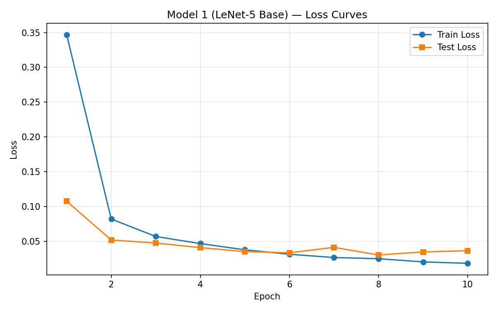
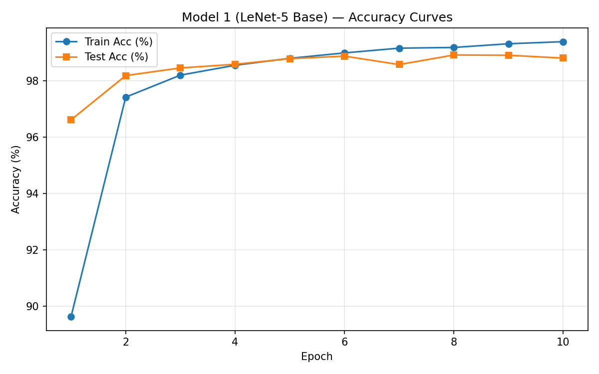
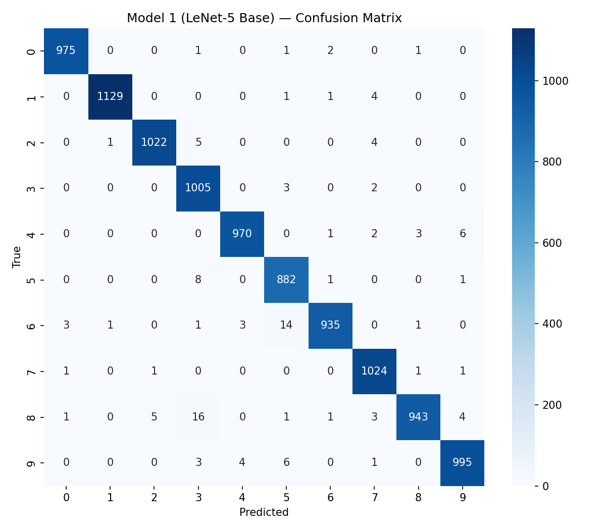

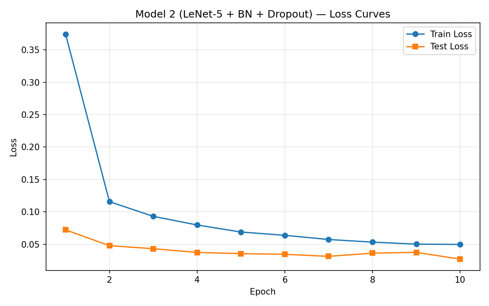
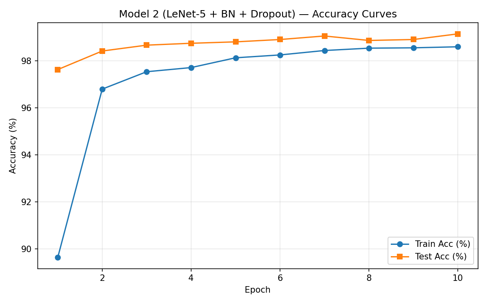
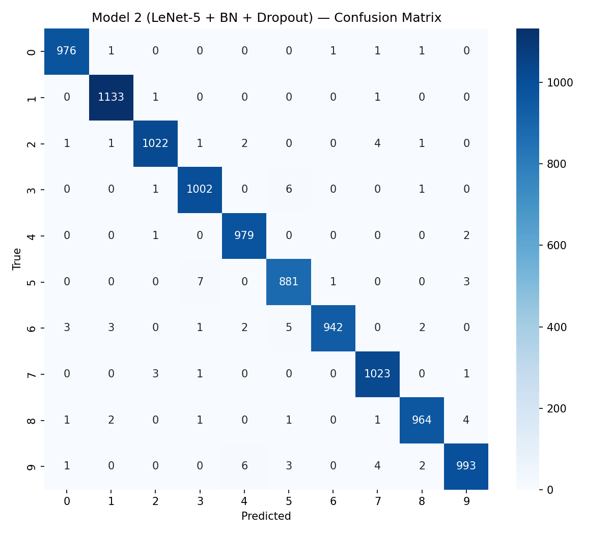

2×2 karşılaştırma (train/test loss + train/test accuracy):

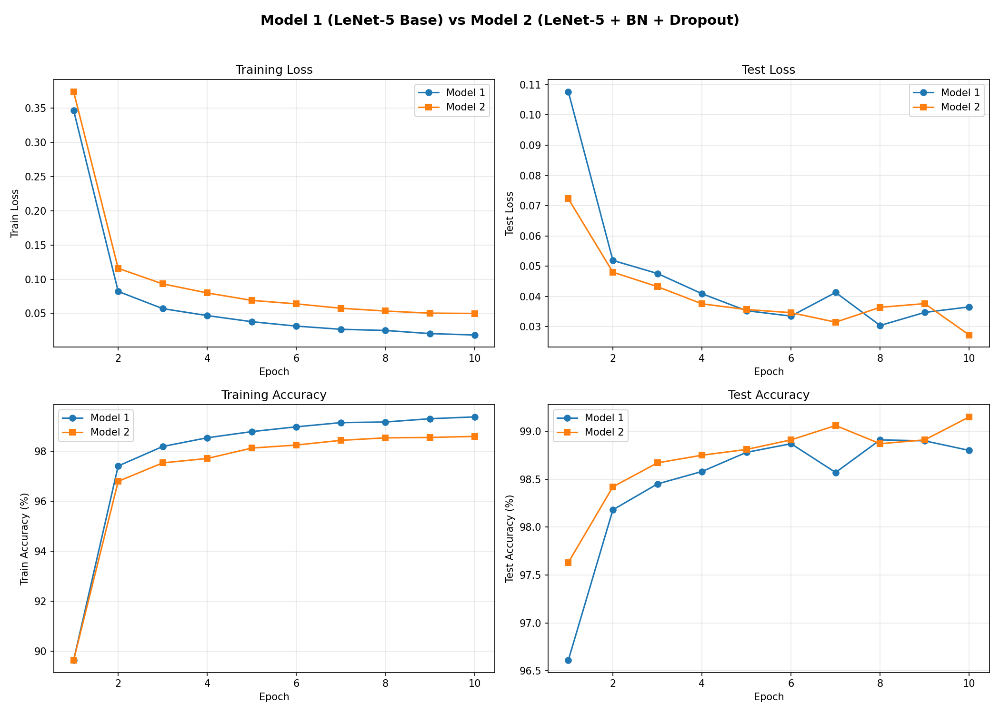

### 3.2 CIFAR-10 (Model 3, 4, 5)

| Model | Params | Train Set | Test Acc | Macro F1 | Eğitim/Fit Süresi | Not |
|---|---|---|---|---|---|---|
| Model 3 (E2E ResNet-18, train-time) | 11 173 962 | 50 000 | 94.07% (final) / **94.08% (best)** | 0.9407 | **435.42 s** | 50 epoch, AMP, SGD+Cosine |
| Model 4a (ResNet-18 emb + SVM) | — | 10 000 (1 000/sınıf) | 94.01% | 0.9401 | 0.17 s | StandardScaler + RBF |
| Model 4b (ResNet-18 emb + RF) | — | 50 000 | 93.96% | 0.9397 | 9.22 s | n_estimators=200 |
| Model 5 (E2E ResNet-18, eval) | 11 173 962 | — (Model 3 ağırlıkları) | **94.08%** | 0.9408 | 13.44 s (eval) | Yeni eğitim yok |

Model 3 eğitim dinamikleri:

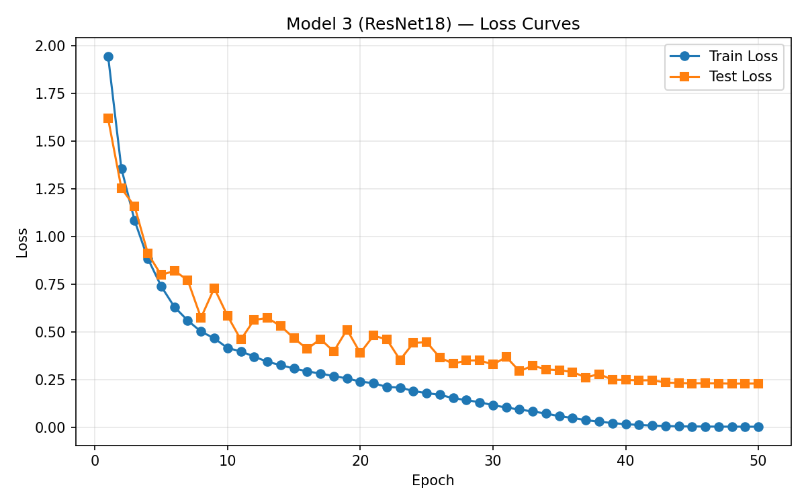
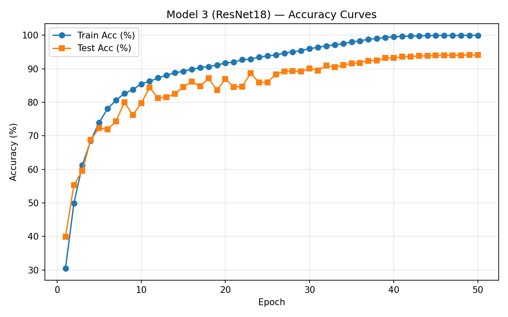


Model 4 karmaşıklık matrisleri:


Model 5 karmaşıklık matrisi:

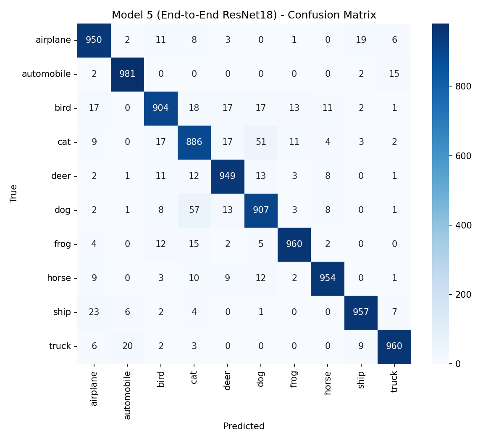

Üç sınıflandırıcının yan yana karşılaştırması:

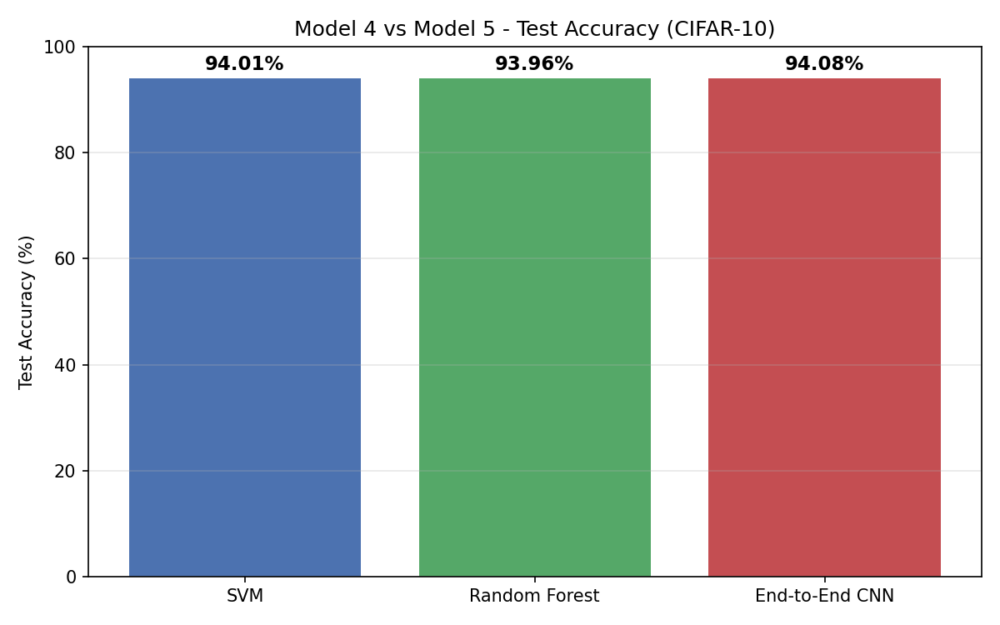

### 3.3 Sınıf Bazlı Performans — CIFAR-10 (F1-score)

| Sınıf | Model 3 | Model 4a SVM | Model 4b RF | Model 5 |
|---|---|---|---|---|
| airplane   | 0.9368 | 0.9397 | 0.9374 | 0.9387 |
| automobile | **0.9751** | **0.9766** | **0.9765** | **0.9756** |
| bird       | 0.9164 | 0.9185 | 0.9170 | 0.9178 |
| cat        | *0.8812* | *0.8789* | *0.8758* | *0.8803* |
| deer       | 0.9422 | 0.9394 | 0.9409 | 0.9443 |
| dog        | 0.9061 | 0.9042 | 0.9017 | 0.9043 |
| frog       | 0.9633 | 0.9585 | 0.9618 | 0.9634 |
| horse      | 0.9617 | 0.9636 | 0.9642 | 0.9602 |
| ship       | 0.9613 | 0.9595 | 0.9584 | 0.9608 |
| truck      | 0.9629 | 0.9623 | 0.9634 | 0.9629 |

(Kalın: en iyi, italik: en zayıf sınıf)

---

## 4. Tartışma

### 4.1 BatchNorm + Dropout'un MNIST üzerindeki etkisi (Model 1 vs Model 2)

Model 2, Model 1'e göre test doğruluğunu **98.80% → 99.15% (+0.35 puan)** ve test loss'u **0.0365 → 0.0273 (−25%)** düzeyinde iyileştirmiştir. Bu fark mutlak değer olarak küçük görünse de MNIST'te son %1'lik dilim en "zor" örneklerden oluşur; hata oranını **1.20% → 0.85%** indirmek, kalan hataların yaklaşık üçte birini ortadan kaldırmak demektir.

Ayrıca Model 1'in train accuracy (99.38%) test accuracy (98.80%) farkı **+0.58** iken, Model 2'de bu fark **−0.55** (train 98.60%, test 99.15%) olarak işaret değiştirmiştir — yani Model 2, Dropout'un bilinen etkisiyle eğitim seti performansını kısıtlayıp genelleme performansını yükseltmiştir. BatchNorm'un katkısı ise eğitim kararlılığı ve daha düşük test loss'udur (aynı epoch sayısında daha iyi kalibre edilmiş çıktılar). MNIST doyuma yakın olduğundan, büyük bir sıçrama değil, bu tür "kalite odaklı" iyileşmeler beklenmelidir — ve bulgu bu beklentiyi doğrulamaktadır.

### 4.2 ResNet-18 CIFAR-10 yakınsaması

Model 3 eğitim logları (bkz. `model3_metrics.json → test_acc_per_epoch`):

| Epoch | Test Acc |
|---|---|
| 1  | 39.95% |
| 10 | 79.71% |
| 20 | 86.96% |
| 30 | 90.04% |
| 40 | 93.24% |
| 50 | 94.07% (final) / 94.08% (best @49) |

%90 eşiği 30. epoch'ta aşılmış, son 10 epoch'ta Cosine LR'nin düşük fazında (lr: 0.012 → 0.0001) +0.83 puanlık son rötuş yapılmıştır. Sıfırdan eğitilen ResNet-18 için %94 dolayı, CIFAR-10 literatüründe beklenen baseline'dır; pretrained ağırlık, daha agresif augmentation (Cutout, AutoAugment), daha uzun eğitim veya daha büyük model olmadan bu seviyede kalmak tutarlı bir sonuçtur.

### 4.3 Model 4 (hibrit) vs Model 5 (uçtan uca) — kim kazandı?

| Sıra | Model | Accuracy | Macro F1 |
|---|---|---|---|
| 1 | Model 5 (E2E CNN) | 94.08% | 0.9408 |
| 2 | Model 4a (SVM) | 94.01% | 0.9401 |
| 3 | Model 4b (RF) | 93.96% | 0.9397 |

Fark yalnızca **0.12 puan**. Bu bulgu iki önemli şeyi göstermektedir:

1. **ResNet-18'in son FC katmanı, 512 boyutlu embedding üzerinde neredeyse doğrusal bir ayırıcıya denktir.** SVM ile RBF kullanılmasına rağmen performansın FC'ye bu kadar yakın olması, embedding uzayında sınıfların zaten iyi ayrıştığını gösterir — öğrenilen temsil, klasik bir sınıflandırıcıya bile "hazır yemek" sunmaktadır.
2. **Gerçek değer CNN'in feature extractor'ında saklıdır.** FC'yi değiştirmek performansta marjinal değişikliklere yol açarken, feature extractor'ı değiştirmek (örneğin ResNet yerine ham pikseller üzerine SVM kurmak) %40 civarı accuracy'ye iner (literatür). Bu proje, bu tezin küçük ama net bir ampirik doğrulamasıdır.

### 4.4 SVM vs Random Forest — hangisi ResNet embedding'leri ile daha iyi?

| | SVM | RF |
|---|---|---|
| Train veri | 10 000 (1 000/sınıf) | 50 000 (tam) |
| Accuracy | **94.01%** | 93.96% |
| Fit süresi | **0.17 s** | 9.22 s |
| Predict süresi | 0.46 s | 0.08 s |

SVM, RF'den 5× az veriyle daha iyi sonuç vermiştir. Sebebi büyük olasılıkla ResNet embedding uzayının yüksek boyutlu (512-d) ve *yaklaşık doğrusal ayrılabilir* olmasıdır — RBF kernel'ın decision boundary'si bu geometriye RF'in piecewise-axis-aligned bölünmelerinden daha iyi uyuyor. Ayrıca StandardScaler, RBF'in gamma='scale' varsayımıyla daha iyi çalışır; RF ölçekten etkilenmediği için bu avantajdan yararlanmıyor. Predict zamanında ise RF (ağaç derinliğinde sabit) SVM'in destek vektör sayısına bağlı maliyetinden daha ucuzdur — iki model farklı pratik karakterleri temsil ediyor.

### 4.5 Parametre sayısı ve eğitim maliyeti

| Model | Params | Train süresi | Test Acc |
|---|---|---|---|
| Model 1 | 61 706 | ~28 s (eğitim) | 98.80% (MNIST) |
| Model 2 | 61 990 | 28.07 s | 99.15% (MNIST) |
| Model 3 | 11 173 962 | 435.42 s | 94.07% (CIFAR-10) |
| Model 4a | ~11 M (fix) + SVM | 0.17 s (yalnız SVM) | 94.01% (CIFAR-10) |
| Model 4b | ~11 M (fix) + RF | 9.22 s (yalnız RF) | 93.96% (CIFAR-10) |
| Model 5 | 11 173 962 | 0 (M3 ağırlıkları) | 94.08% (CIFAR-10) |

Model 3 bir kez eğitildikten sonra Model 4a/4b/5'in ek maliyetleri çok düşük kalmaktadır — bu, endüstriyel pratikte pretrained backbone + task-specific head tasarımının neden baskın olduğunu göstermektedir.

### 4.6 Cat–dog karışıklığı

Dört CIFAR-10 modelinde de en zayıf iki sınıf **cat** (F1 ≈ 0.88) ve **dog** (F1 ≈ 0.90) olmuştur. Karmaşıklık matrisleri incelendiğinde hata kütlesinin simetrik olarak cat↔dog arasında yoğunlaştığı görülmektedir. Bu örüntü tüm modellerde aynı olduğundan, hatanın sınıflandırıcı türünden değil **temsilin ayrım gücünden** (veya bizzat görsel belirsizlikten: küçük 32×32 çözünürlükte kedi/köpek ayrımı zor) kaynaklandığı sonucuna varılır. Sınıflandırıcıyı değiştirmek bu hatayı düzeltmez; daha güçlü bir backbone (ResNet-50, WideResNet) veya daha yüksek çözünürlüklü veri gerekir.

### 4.7 Sınırlamalar

- **Hiperparametre taraması yok.** SGD/Adam, LR, batch size, Dropout oranı, RF `n_estimators`, SVM `C`/`gamma` sabit seçildi; grid/random search yapılmadı.
- **Model 3 için 50 epoch sabit.** Oturum kuralları gereği sabit tutuldu; 100–200 epoch + AutoAugment ile %95+ erişilebilirdi.
- **SVM subsample.** RBF SVM'in O(N²) bellek maliyeti nedeniyle her sınıftan 1000 örnek alındı; tam setle farklı sonuç verebilir (muhtemelen biraz daha iyi ancak saatler sürer).
- **Tek seed.** Stokastik dalgalanmayı ölçmek için çoklu seed ortalaması alınmadı.
- **Tek GPU, tek donanım.** Sonuçlar RTX 5070 Ti Laptop üzerinde raporlandı.

### 4.8 Gelecek çalışmalar

1. ImageNet pretrained ResNet-18 ile transfer öğrenme (Model 3 üstünde).
2. CutMix, MixUp, AutoAugment gibi modern augmentation stratejileri.
3. SVM için tam train setinde Linear SVM veya approximate RBF (RFF / Nyström) denemesi.
4. Ensemble: Model 4a + 4b + 5 çıktılarının oylama/ortalamayla birleştirilmesi.
5. Grid search veya Bayesian optimization ile hiperparametre taraması.
6. Daha büyük backbone'lar (ResNet-50, ViT-Tiny) ile karşılaştırma.

---

## 5. Referanslar

1. LeCun, Y., Bottou, L., Bengio, Y., & Haffner, P. (1998). Gradient-based learning applied to document recognition. *Proceedings of the IEEE*, 86(11), 2278–2324.
2. He, K., Zhang, X., Ren, S., & Sun, J. (2016). Deep residual learning for image recognition. *IEEE Conference on Computer Vision and Pattern Recognition (CVPR)*, 770–778.
3. Krizhevsky, A. (2009). *Learning multiple layers of features from tiny images*. Technical report, University of Toronto.
4. Ioffe, S., & Szegedy, C. (2015). Batch normalization: Accelerating deep network training by reducing internal covariate shift. *International Conference on Machine Learning (ICML)*, 448–456.
5. Srivastava, N., Hinton, G., Krizhevsky, A., Sutskever, I., & Salakhutdinov, R. (2014). Dropout: A simple way to prevent neural networks from overfitting. *Journal of Machine Learning Research*, 15(1), 1929–1958.
6. Paszke, A., Gross, S., Massa, F., vd. (2019). PyTorch: An imperative style, high-performance deep learning library. *Advances in Neural Information Processing Systems (NeurIPS)*, 32.
7. Pedregosa, F., vd. (2011). Scikit-learn: Machine learning in Python. *Journal of Machine Learning Research*, 12, 2825–2830.
8. Referans LeNet-5 uygulaması: https://github.com/activatedgeek/LeNet-5
9. torchvision modelleri: https://pytorch.org/vision/stable/models.html

---

## Çalıştırma Talimatları

**Gereksinimler:**
- Python 3.9+
- CUDA uyumlu NVIDIA GPU (projede RTX 5070 Ti Laptop kullanıldı)
- PyTorch 2.x + cu12.x/cu13.x
- scikit-learn, numpy, matplotlib, seaborn, torchvision

**Kurulum:**

```bash
pip install -r requirements.txt
```

**Scriptleri sırayla çalıştır (önerilen sıra):**

```bash
# MNIST modelleri
python scripts/train_model1_mnist.py
python scripts/train_model2_mnist.py
python scripts/compare_model1_2.py

# CIFAR-10 uçtan uca (Model 3) — bu adım ~7 dk
python scripts/train_model3_resnet_cifar.py

# Hibrit (Model 4)
python scripts/extract_features_model4.py
python scripts/train_model4_hybrid.py

# Eval-only (Model 5) + karşılaştırma
python scripts/evaluate_model5_resnet.py
```

**Opsiyonel notebook (çekirdek teslimin parçası değildir):**

```bash
jupyter notebook notebooks/lenet5_completed.ipynb
```

**Teslim için kısa kontrol listesi:**

- `README.md` IMRAD formatındadır ve yöntem, sonuç, tartışma, referans bölümlerini içerir.
- `models/` altında Model 1 ve Model 2 açık CNN sınıfları, Model 3 için ise adapte edilmiş ResNet-18 tanımı vardır.
- `scripts/` altında eğitim, özellik çıkarma, hibrit sınıflandırma ve karşılaştırma scriptleri bulunmaktadır.
- `results/metrics/` altında tüm ana modeller için metrik JSON ve classification report dosyaları vardır.
- `results/figures/` altında loss, accuracy ve confusion matrix görselleri ile karşılaştırma grafikleri vardır.
- `results/features/` altındaki `.npy` dosyaları ve `results/*.pth` ağırlıkları scriptlerle yeniden üretilebilir; repoda bulunmaması teslimi tek başına geçersiz kılmaz.

**Repo notu:**

- VS Code içinde `.npy` ve `.pth` dosyalarının metin editöründe görünmemesi normaldir; bu dosyalar ikili formatta tutulur.
- GitHub'a push ederken `.gitignore` nedeniyle büyük `.pth` ve `.npy` dosyaları dışarıda kalabilir. Bu proje için tercih edilen teslim biçimi budur.

**Üretilen çıktılar:**

```
results/
├── model3_weights.pth                          (best Model 3 ağırlıkları)
├── features/
│   ├── X_train.npy, y_train.npy
│   └── X_test.npy,  y_test.npy
├── metrics/
│   ├── model{1,2,3}_metrics.json
│   ├── model{1,2,3}_classification_report.txt
│   ├── model4_{svm,rf}_metrics.json
│   ├── model4_{svm,rf}_classification_report.txt
│   ├── model5_metrics.json
│   ├── model5_classification_report.txt
│   └── model4_vs_model5_comparison.json
└── figures/
    ├── model{1,2,3}_{loss,accuracy,confusion_matrix}.png
    ├── model1_vs_model2_comparison.png
    ├── model4_{svm,rf}_confusion_matrix.png
    ├── model5_confusion_matrix.png
    └── model4_vs_model5_bar.png
```
