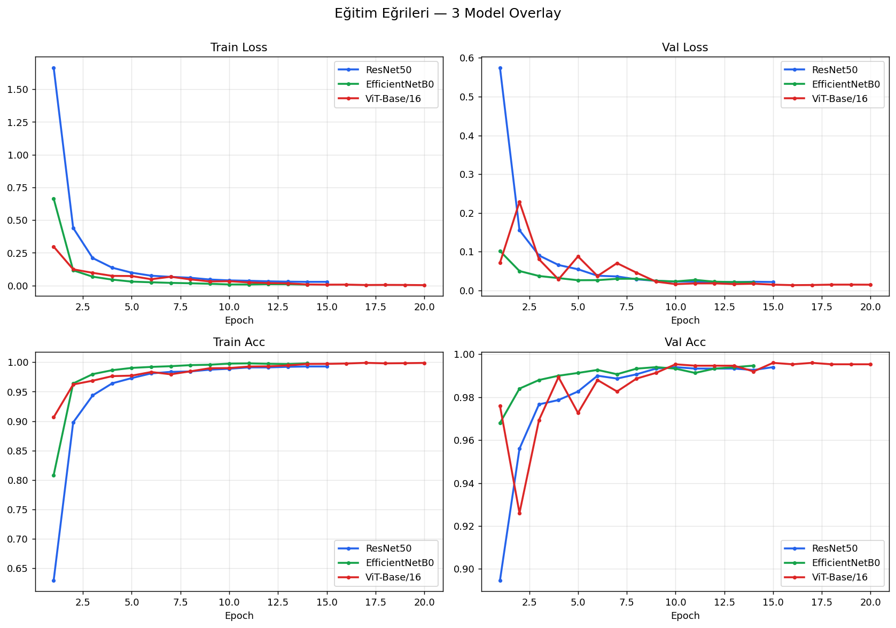
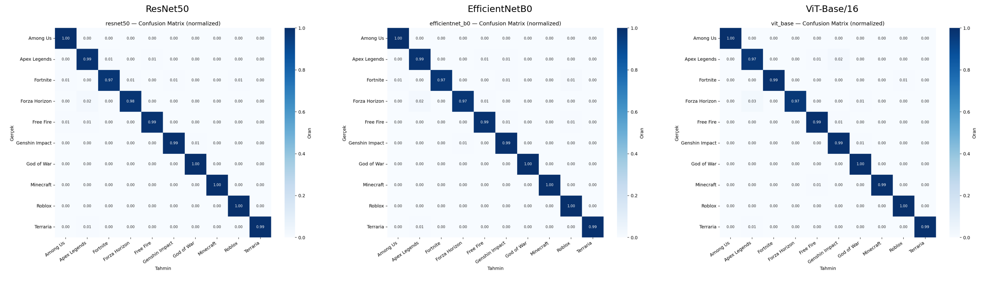
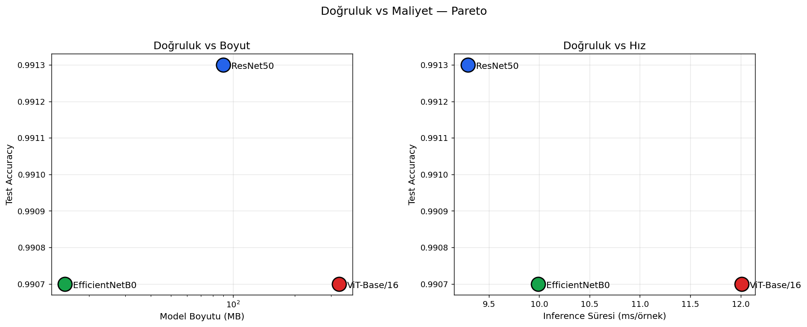
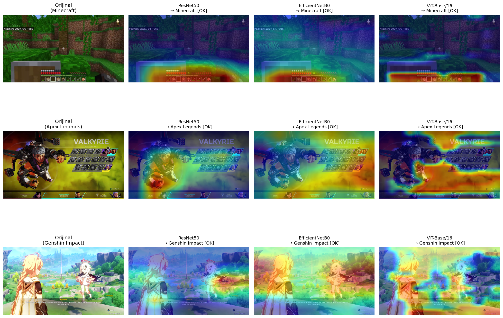

# Oyun Ekran Görüntülerinden Oyun Tespiti

**Transfer Learning Tabanlı CNN ve Vision Transformer Mimarilerinin Karşılaştırmalı Analizi**

> *Video Game Identification from Gameplay Screenshots: A Comparative Analysis of Transfer Learning Based CNN and Vision Transformer Architectures*

YZM304 Derin Öğrenme — 4. Proje · Ankara Üniversitesi · 2025–2026 Bahar

---

## Özet

Bu proje, 10 popüler video oyununa ait ekran görüntülerini sınıflandırmak için **3 farklı derin öğrenme mimarisini** karşılaştırır: klasik CNN (ResNet50), modern verimli CNN (EfficientNetB0) ve Transformer tabanlı (Vision Transformer — ViT-Base/16). Modeller test set doğruluğu, eğitim süresi, model boyutu ve inference hızı açısından analiz edilir; ek olarak proje, eğitilmiş modelleri **lokal bir web arayüzünde** (FastAPI + React + TypeScript) interaktif olarak test edilebilir hale getirir.

Web demosu üç moda izin verir: tek model çalıştırma, üç modeli yan yana karşılaştırma, Grad-CAM ile modelin **nereye baktığını** görselleştirme. Ayrıca **belirsizlik göstergesi** (entropy + margin tabanlı) closed-set softmax sınıflandırıcının "out-of-distribution" sorununu pratik olarak gösterir.

## Sınıflar (10 Oyun)

Among Us · Apex Legends · Fortnite · Forza Horizon · Free Fire · Genshin Impact · God of War · Minecraft · Roblox · Terraria

## Veri Seti

| Özellik | Değer |
|---|---|
| Kaynak | [Kaggle — Gameplay Images](https://www.kaggle.com/datasets/aditmagotra/gameplay-images) |
| Toplam görsel | 10.000 (sınıf başına 1000) |
| Boyut | 640 × 360 PNG (eğitimde 224×224'e resize) |
| Toplam | ~2.5 GB |
| Split | 70% / 15% / 15% (train / val / test, stratified, seed=42) |

EDA çıktıları: [results/eda_report.md](results/eda_report.md) · [results/figures/](results/figures/)

## Sonuçlar

Test seti üzerinde (1500 görsel), AMP (mixed precision) ile eğitildi:

| Model | Paradigma | Test Acc | Macro-F1 | Top-3 Acc | Parametre | Boyut | Inference (ms) | Eğitim (dk) |
|---|---|---|---|---|---|---|---|---|
| **ResNet50** | Klasik CNN | **0.9913** | **0.9913** | 0.9973 | 23.5 M | 89.8 MB | 9.3 | 10.6 |
| **EfficientNetB0** | Modern CNN | 0.9907 | 0.9907 | **0.9973** | **4.0 M** | **15.3 MB** | **9.0** | **9.5** |
| **ViT-Base/16** | Transformer | 0.9907 | 0.9907 | 0.9953 | 85.8 M | 327.3 MB | 12.0 | 19.5 |

### Bulgular

- **3 model de %99+ test doğruluğu**a ulaştı — bu dataset için 3 mimari de yeterli.
- **ResNet50 marjinal lider** (0.06% fark — istatistiksel gürültü içinde).
- **EfficientNetB0 verimlilik kralı**: 21× daha az parametre, 6× daha küçük model dosyası, en hızlı eğitim, neredeyse aynı doğruluk → **deployment için optimal**.
- **ViT-Base/16 en yüksek validation accuracy**'yi (0.9960) elde etti ama test'te küçük overfit gösterdi (0.5% gap).
- **Mimari seçimi doğruluk değil verimlilik kısıtları (cihaz, eğitim bütçesi) tarafından belirlenmeli.**

Detaylı analiz: [`notebooks/05_comparison.ipynb`](notebooks/05_comparison.ipynb)

### Görselleştirmeler

| | |
|---|---|
|  |  |
|  |  |

## Modeller

Tüm modeller [timm](https://github.com/huggingface/pytorch-image-models) üzerinden ImageNet pretrained ağırlıklarla başlatıldı:

- **ResNet50** — `timm: resnet50` — He et al. 2015
- **EfficientNetB0** — `timm: efficientnet_b0` — Tan & Le 2019
- **ViT-Base/16** — `timm: vit_base_patch16_224` — Dosovitskiy et al. 2020

Ortak eğitim protokolü: AdamW + CosineAnnealingLR, weight decay 1e-4, 20 epoch (early stopping patience=5), AMP mixed precision, batch_size 32 (ViT için 16).

## Kurulum ve Çalıştırma

### Bağımlılıklar

```bash
pip install -r requirements.txt
```

### Veri hazırlama

Kaggle'dan dataset'i indir, kök dizinde `Dataset/` olarak yerleştir; ardından:

```bash
python scripts/run_eda.py        # EDA + sample grid
python scripts/run_split.py      # 70/15/15 stratified split
```

### Eğitim

```bash
python -m src.train --model resnet50 --amp
python -m src.train --model efficientnet_b0 --amp
python -m src.train --model vit_base --amp
# Crash sonrası kaldığı yerden devam:
python -m src.train --model vit_base --amp --resume
```

Çıktılar `results/models/<model>.pth`.

### Değerlendirme

```bash
python -m src.evaluate --model resnet50 --training-time-min 10.6
```

Çıktılar: confusion matrix, sınıf bazlı F1 raporu, Top-3 accuracy → `results/figures/` ve `results/metrics.csv`.

### Web Demo

Eğitilmiş ağırlıklar mevcutsa (`results/models/*.pth`):

```bash
# Backend (terminal 1)
cd webapp/backend
pip install -r requirements.txt
python -m uvicorn main:app --reload     # http://127.0.0.1:8000

# Frontend (terminal 2)
cd webapp/frontend
npm install
npm run dev                              # http://localhost:5173
```

Detaylı talimatlar: [webapp/README.md](webapp/README.md) · [webapp/frontend/README.md](webapp/frontend/README.md)

#### Demo özellikleri

- **Drag-drop görsel yükleme** + 10 sınıf için hazır örnekler
- **Tek model modu**: Top-3 tahmin + Grad-CAM heatmap (CNN için GradCAM, ViT için EigenCAM)
- **Karşılaştırma modu**: 3 model yan yana, konsensüs/çelişki banner'ı
- **Belirsizlik göstergesi**: entropy + margin tabanlı 🟢 Kesin / 🟡 Şüpheli / 🔴 Belirsiz rozeti — closed-set softmax'in OOD sorununu görselleştirir
- **Heatmap legend**: kırmızı bölgeler model kararına en çok katkıda bulundu

## Klasör Yapısı

```
proje4/
├── src/                              # Eğitim/değerlendirme modülleri
│   ├── config.py                     # Hiperparametreler, sınıf isimleri
│   ├── dataset.py                    # PyTorch Dataset
│   ├── transforms.py                 # Augmentation pipeline
│   ├── models.py                     # 3 modelin factory'si (timm)
│   ├── train.py                      # Eğitim entry-point (AMP, resume, incremental history)
│   ├── evaluate.py                   # Test set metrikleri
│   ├── visualize.py                  # Confusion matrix, eğri plot'ları
│   ├── gradcam_utils.py              # Grad-CAM/EigenCAM yardımcıları
│   └── utils.py
│
├── scripts/                          # Yardımcı scriptler
│   ├── run_eda.py
│   ├── run_split.py
│   ├── reconstruct_history.py        # Crash sonrası stdout log'tan history kurtarma
│   └── build_comparison_notebook.py
│
├── notebooks/
│   └── 05_comparison.ipynb           # 3 model side-by-side analizi
│
├── results/
│   ├── models/                       # .pth ağırlıkları (repoda yok — eğit)
│   ├── figures/                      # Confusion matrix, eğriler, Grad-CAM örnekleri
│   ├── logs/                         # history.csv + stdout logları
│   └── metrics.csv                   # Tüm modellerin sonuç tablosu
│
└── webapp/
    ├── backend/                      # FastAPI + Grad-CAM endpoint
    │   ├── main.py                   # /predict, /predict/all, /gradcam, /gradcam/all
    │   ├── inference.py              # Model lazy-load + uncertainty hesabı
    │   └── gradcam.py                # Backend overlay üretimi
    └── frontend/                     # Vite + React + TS + Tailwind v4
        ├── src/
        │   ├── pages/                # Upload → ModelSelect → Results
        │   ├── components/           # DropZone, ModelCard, GradCamView,
        │   │                         # ConfidenceBadge, ComparisonResultView ...
        │   └── lib/                  # api, types, state, modelMeta
        └── public/sample_images/     # Demo için 10 örnek görsel
```

Tam plan: [IMPLEMENTATION_PLAN.md](IMPLEMENTATION_PLAN.md)

## Sınırlamalar

- **Closed-set sınıflandırma**: Model her zaman 10 sınıftan biri olarak tahmin yapar; "bilmiyorum" diyemez. Web demosundaki belirsizlik rozeti bu sınırı pratik olarak görselleştirir.
- **Out-of-distribution**: Listede olmayan oyun (Cyberpunk, Valorant vb.) yüklenirse modeller görsel olarak en yakın sınıfı seçer. 3 modelin tahminleri çelişiyorsa **bu OOD sinyalidir**.
- **Veri çeşitliliği**: Her oyunda farklı sahneler/menüler/UI'lar var ama benchmark dataset boyutunda. Generalization yeni karakter/harita/UI'larda zayıflayabilir.

## Referanslar

- He et al., *"Deep Residual Learning for Image Recognition"* (2015)
- Tan & Le, *"EfficientNet: Rethinking Model Scaling for CNNs"* (2019)
- Dosovitskiy et al., *"An Image is Worth 16×16 Words: Transformers for Image Recognition at Scale"* (2020)
- Selvaraju et al., *"Grad-CAM: Visual Explanations from Deep Networks via Gradient-based Localization"* (2017)
- Bany Muhammad & Yeasin, *"Eigen-CAM: Class Activation Map using Principal Components"* (2020)
- Hendrycks & Gimpel, *"A Baseline for Detecting Misclassified and Out-of-Distribution Examples in Neural Networks"* (2017)
- *"From Pixels to Titles: Video Game Identification by Screenshots using CNNs"* — arXiv:2311.15963

## Yazar

**Mehmet Ali Topkara** — 23291093 · Ankara Üniversitesi, Yapay Zeka ve Veri Mühendisliği

## Lisans

Akademik kullanım için.
